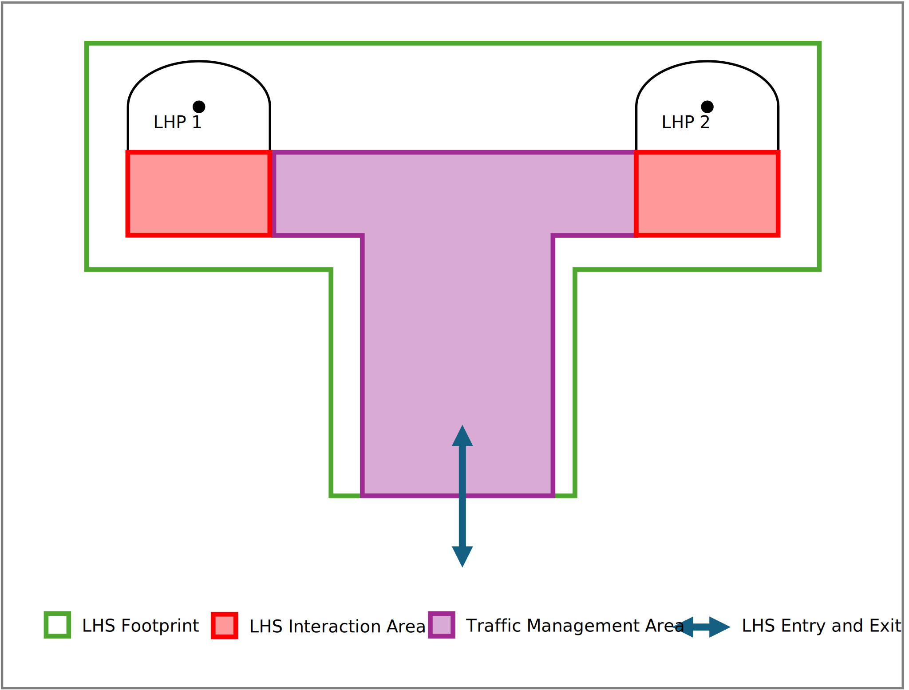

:xrefstyle: short
:sectnums: 

// = Table of Contents
:toc: auto
// :toc-title:

== M2X - Interface for communication between mobile robots and peripherals in industrial environments
Version 0.1.0, August 2024

=== Brief information
The aim is to design universally applicable interfaces for communication between the fleet management (FM)/mobile robots (MR) (such as automated guided vehicles (AGVs) or autonomous mobile robots (AMRs)) and other participants in an industrial environment like load handling stations, order generation, peripherals etc. 
The project is supported by the VDMA and various partners from industry. 
For comments, desired content or bug fixes, an issue or pull request should be submitted to GitHub. 
*The project is work in progress.*

=== Disclaimer
The following explanations serve as a definition of interfaces and execution of communication between MRs, FM and peripherals.
Those who use them must ensure that they are applied correctly in specific cases.
Responsibilities regarding implementation and adaptation in practice must be documented among the project participants. 
M2X also requires that the data quality of an implementation is sufficiently good and that there is a consensus among the parties involved on terminology, for example.

If you encounter any inaccuracies in the application of the proposals or the possibility of an incorrect interpretation, please report them in the official https://github.com/M2X-Project/m2x/issues[issues] of the M2X GitHub repository.

=== Official M2X Documentation

The latest official documentation can be found on the https://m2x-project.github.io/m2x/[GitHub page].

== Introduction
M2X (Machine to X) is a research project developed by the Chair of Material Handling and Warehousing at TU Dortmund University and the Fraunhofer Institute for Material Flow and Logistics IML (associated partner). 
The project gets support by the VDMA (German, Verband Deutscher Maschinen- und Anlagenbau e. V.) and various partners from industry. 
Content is developed jointly between the research partners and the industry and the result is made publicly available in the form of the M2X interface definition.
The aim of the project is to design a universally applicable interfaces for communication between a FM or/and MRs (such as automated guided vehicles (AGVs) or autonomous mobile robots (AMRs)) and a industrial environment (load handling stations, order generation, peripherals, MR to X).  
Proposed changes to the interface are to be posted in the https://github.com/M2X-Project/m2x[GitHub repository]. 
They will be jointly evaluated by the working group and, if the decision is positive, adopted in a new version.

=== Background and motivation

Warehousing is increasingly relying on MRs. 
However, the implementation of MR systems is both time-consuming and cost-intensive and poses a challenge for both large companies and SMEs (small and medium sized companies). 
Interface definitions such as VDA 5050 standardize the connection between a FM and MRs and enable the cost-efficient use of heterogeneous fleets through interoperability. 
The M2X project, aims to reduce integration costs through further standardization in the MR context. 
Further necessary interfaces are identified and described using easily applicable, generally valid models. 
M2X enables companies to integrate automation quickly and cost-effectively. 
This gives companies a sustainable competitive advantage and secures their future on the market.
The project and the associated requirements are defined and iteratively adapted in close communication with our partners. 
The interfaces identified so far for M2X are as follows:

* Load handling station,
* Order generation,
* Peripherals (doors, elevators, (signal) lamps and traffic lights),
* MR to MR or attachment.

The project is funded by the Federal Ministry for Economic Affairs and Climate Protection (BMWK) as part of the Industrial Collective Research (IGF).

=== Current status and participating at M2X
The next steps, will deal with the load handling interface. 
The working group meets at regular intervals to discuss and publish the new content to the M2X project.
New content will be pre-released in the private repository.
News updates on content or meetings can be found at the https://www.linkedin.com/showcase/m2x-project[LinkedIn page].

The project has the status work in progress. 
For comments, desired content or bug fixes, an issue or pull request should be submitted to https://github.com/M2X-Project/m2x/issues[GitHub issues].
For a direct contact via mail please refer to sven.franke@tu-dortmund.de and dennis.luensch@iml.fraunhofer.de

[#objective_and_scope_of_m2x, reftext="Section: Objective and Scope of M2X"]
== Objective and scope of M2X
The aim of the interface is to simplify the commissioning of MR systems in an existing industrial environment (peripherals, load handling stations, order generation, MR to MR or attachment) when used in industry. 
The interface should enable the seamless operation of different peripherals from different manufacturers and conventional systems (existing systems).
xref:m2x_overview[] shows the idea of the M2X framework.
In detail, this is to be achieved through the following points:

* Description of a standardized communication between MRs or FM and existing environment.
* Increased flexibility and autonomy of MR systems in the industrial environment.
* M2X provides communication processes and -content of the participants. 
Sequence diagrams and JSON schemas are provided for this purpose. 
The technical implementation is not prescribed and can take place at various levels, such as MR or FM and the environment itself. Implementation examples and best practices are provided.
* The interfaces presented should come as close as possible to plug & play solutions.
* The interfaces are developed from simple to complex contents or use cases. 
* M2X will provide no safety considerations in the JSON schemas in a detailed level, but there can be use cases or examples on how to deal with the most occurring safety issues. 
Safe communication protocols, e.g. via PROFIsafe, are not considered.
* M2X will be fully compatible with the VDA 5050 but it is not a requirement to use M2X.
* The description of the communication is described middleware neutral. 
Nevertheless, It is assumed that the communication type follows a topic-based publish-subscribe communication.

The scope of M2X is not to operate at the PLC level.
Described communication is located on a higher level with logic that manages states of the peripheral and communication processes.
Besides that more complex communication protocols with a publish subscribe pattern are used.
Hence, M2X assumes that the communication and state management is done by a specialized software, within this document called "Proxy".
Depending on the M2X support of the peripheral, several different software solutions for legacy and future peripherals are possible.
The following figures show the various solutions for setting up peripheral devices in an MR system with M2X.
// [#m2x_application_scope, reftext="Section: Application Scope of M2X"]   

xref:m2x_application_scope_nowadays[] illustrates the current status of integrating peripherals into a MR system. 
Peripherals are typically integrated and controlled by the FM. 
Hence, the proprietary interface of the peripheral is used and tailored to the costumer. 

To overcome this monolithic FM approaches, M2X provides a standardized interface to interact with the peripheral.
Thus the FM don't need to handle and control the peripheral directly.
Consequently, the responsibility of the FM is reduced, making the software leaner and more flexible in the event of changes to the system due to the connection of standardized interfaces . 
xref:m2x_application_scope_m2x[] shows the implementation for current and legacy systems.
Here, logic and the proprietary interface of the peripheral is managed by a proxy. 
In this case, the proxy must be supplied subsequently, which can be carried out by an integrator, the FM supplier etc.
Hereby, the proxy can manage multiple peripherals of the same type from one or different manufacturers.
Its also possible also possible to manage different types of peripherals.
The complexity is up to the developer and supplier of the proxy.

The aim of standardization should be the direct application of the standard. 
This means that future peripherals will be directly compatible with the M2X standard.
Hence, the manufacturer of the peripheral will implement the M2X standard themselves providing a external proxy for the peripheral or providing an all in one solution (cf. xref:m2x_application_scope_m2x_beyond[]).
To meet the requirements of Industry 4.0 and its self-management principles, each device will have its own proxy for autonomous communication and management. 

[cols="a,a,a"]
|===
| image::./assets/figures/m2x_application_scope_nowadays.svg[title="", id=m2x_application_scope_nowadays,align="center"]
| image::assets/figures/m2x_application_scope_m2x.svg[title="", id=m2x_application_scope_m2x,align="center"]
| image::assets/figures/m2x_application_scope_m2x_beyond.svg[title="", id=m2x_application_scope_m2x_beyond,align="center"]
|===

=== Other applicable documents
|===
|document|title

|VDA 5050|Interface for the communication between automated guided vehicles (AGV) and a master control
|VDI 2510|Automated Guided Vehicle Systems (AGVS)
|VDI 2710|Interdisciplinary design of automated guided vehicle systems (AGVS)
|VDI 4451|Compatibility of Automated Guide Vehicle Systems (AGVS)
|DIN EN ISO 3691-4|Industrial trucks - Safety requirements and verification - Part 4: Driverless industrial trucks and their systems
|===

== M2X protocol specification
The following section describes the details of the communication protocol. 
The protocol specifies the communication between the MR/FM and the environment.

The different messages are presented in tables describing the contents of the fields of the JSON that is sent as an request, state, etc. 

In addition, JSON schemas are available for validation in the https://github.com/M2X-Project/m2x/tree/main/json_schemas[corresponding GitHub repository]. 
The JSON schemas are updated with every release of M2X.

=== Symbols of the tables and meaning of formatting
The table contains the name of the identifier, its unit, its data type, and a description, if any.
|===
|identification|description

|standard|Variable is an elementary data type.
|*bold*|Variable is a non-elementary data type (e.g., JSON object or array) and defined separately.
|_italic_|Variable is optional.
|*_italic and bold_*|Variable is optional and a non-elementary data type.
|arrayName [arrayDataType]|Variable (here arrayName) is an array of the data type included in the square brackets (here the data type is arrayDataType).
|===
All keywords are case sensitive. 
All field names are in camelCase. 
All enumerations are in UPPERCASE without underscores.

=== Permitted characters and field lengths
All communication is encoded in UTF-8 to enable international adaption of descriptions. 
The recommendation is that IDs should only use the following characters: A-Z a-z 0-9 _ - . :

A maximum message length is not defined. 
If an entities memory is insufficient to process an incoming requests, it is to reject the request. 
The matching of maximum field lengths, string lengths or value ranges is up to the integrator. 
For ease of integration, vendors must supply a factsheet that is detailed in the corresponfing section.

=== Notation of enumerations
Enumerations must be written in uppercase. 
This includes keywords such as the states of the actions and requests (RUNNING, COMPLETED, etc...) or values of the "direction" field (LEFT, RIGHT, 443MHZ, etc...).

=== JSON Datatypes
Where possible, JSON data types must be used. 
A Boolean value is thus encoded by "true / false", NOT with an enumeration (TRUE, FALSE) or magic numbers.

=== Protocol header
Each JSON starts with a header. 
In the following sections, the following fields will be referenced as header for readability. 
The header consists of the following individual elements. 
The header is not a JSON object.
|===
|object structure / identifier|data type|description

|timestamp|string|Timestamp (ISO 8601, UTC); YYYY-MM-DDTHH:mm:ss.fffZ (e.g. 2017-04-15T11:40:03.123Z).
|version|string|Version of the protocol [Major].[Minor].[Patch] (e.g. 1.3.2).
|===

== General Topic Structure ==

Since M2X assumes a publish-subscribe communication, the following topic structure is used:

*/interfaceName/majorVersion/uniqueEntityName/topic*

Description of the elements:

* *interfaceName*: Name of the interface (e.g. lhs (load handling station), door, elv (elevator)). The detailed definition of the interface is described in the respective sections.
* *majorVersion*: Major version of the M2X protocol.
* *uniqueEntityName*: Unique Name of the Entity (e.g. lhs_dispatch_1, etc.). Besides a human-readable name, a unique identifier like a serial number can also be used.
* *topic*: The topic of the message (e.g. request, status, factsheet, etc.). Possible topics are defined and described in the respective sections of the entities.

== Load handling interface
M2X provides communication content and communication processes for the description of load handling/transfer. 
Communication during load handling can take place between FM and station or MR and station. 
The MR actively transfers or receives a load to a load handling station. 
The transfer or receipt of a load is called PICK or DROP, which only refers to the physical process and not an action as in VDA 5050.

*Definition of _load handling_:* _Load handling_ refers to the handover of a load at a transfer point or point of interest. 
This includes the entry, the physical handover/manipulation and the exit of an MR at a station. 
Once the physical load transfer of a MR is in progress, it should not be paused.

*Definition _load handling station_:* A _load handling station_ (LHS) serves as a point of interest at which the load is transferred or changed/manipulated. 
The station can have multiple _load handling points_ which are comparable to a VDA 5050 “node”. 
To avoid confusions regarding the VDA 5050 it is called _load handling point_.
The _load handling station_ will provide no traffic management.
It is assumed that there is a traffic management that takes care of the coordination of the MRs. 
Hence, the coordination and deadlock avoidance of the MRs at the different _load handling points_ is managed by the traffic management. Meaning that the station will only manage the interaction areas of the _load handling points_.
The station will only manage itself.
The station can decide if a MR can approach a _load handling point_ or not.
The _load handling station_ factsheet includes the geometry of the physical station (footprint of the station). 
The area around is managed by the FM.

*Definition _load handling point_:* A _load handling point_ is a physical point of a _load handling station_ where the load is transferred or changed/manipulated. 
Only one MR can interact with a _load handling point_ at the same time. 
The _load handling point_ can be approached from different directions (list of polygons) (cf. xref:load_handling_station_view[]).
If there are two or more load handling points which share the same interaction area in one station, the interaction area is managed by the corresponding load handling station.

The xref:load_handling_station_view[figure] below shows an exemplary use case in which two load handling points occur. One station has two load handling points. 
The outer rectangular frame indicates the station footprint. 
The black frames represent the two physical load handling points in the environment. 
The black dots indicate the geometric handover point (see link:assets/json_schemas/load_handling_station_factsheet.schema[Load Handling Station Factsheet] .loadHandlingPoints.handoverArea). 
The red interaction area of the MRs, which can approach the station from both sides (indicated by the arrows). 
The station only manages itself and blocks the interaction area if necessary (state .loadHandlingPointAvailable). 
Which MR approaches the station and how is determined for example by a traffic management or another management system.
The second xref:lhs_with_traffic_management[figure] shows a load handling station with a shared traffic management area. The staion has two load handling points. As already mentioned it only manages its own load handling points with the corresponding interaction areas. All other passable routes of an MR, even within the station footprint, are controlled by Traffic Management.
If two different Load Handling Stations share the same interaction area, it is recommended to configure them as one and follow the procedure described above.

=== Requirements for a M2X load handling station
This section describes the requirements for a load handling station to use the M2X protocol. 
It is assumed that a load handling station is an active participant that can actively communicate and manage its status. 
The following points are requirements that a station must fulfill:

* A load handling station is at least represented by a physical area and a software that can handle the status of this area and can communicate with other participants.
* The software of the load handling station manages the process and states described in xref:load_handling_sequence_diagram[xrefstyle=short] (e.g. requestAccess, requestExit, requestLoadTransfer, revokeAccess ...).
* It has an unique ID and can describe itself via a factsheet.
* Is assigned to an unique position and represents an area in the industrial environment.
* The load handling station shall be represented in a global map in the factory coordinate system with its position and dimensions.

=== Safety considerations for load handling
As already mentioned in the xref:objective_and_scope_of_m2x[] there will be no further safety considerations in the protocol. 
The purpose of the interface is to provide a functional plug & play approach. 
Safety regarding entries and exits can be abstracted/indirectly set via requirements for the accuracy of the position to be taken (see link:assets/json_schemas/load_handling_station_factsheet.schema[Load Handling Station Factsheet] .loadHandlingPoints.handoverArea). 
Considerations in the communication process for mutings at stations are included and can be taken into account.

=== Errors
If an error occurs the station reports errors via the errors array. 
Errors have two levels: WARNING and FATAL. 
A WARNING is a self-resolving error, e.g., a field violation. A FATAL error needs human intervention. 
Errors can pass references that help with finding the cause of the error via the errorReferences array. 
Errors occuring on the MR side are not resolved by M2X. 
The implementation is described in the relevant JSON schemas. 
A error message can include the following information:

* headerId,
* Topic,
* requestId if an error was caused by the request,
* List of parameters if error was caused by erroneous request parameters.
If an request cannot be completed because of external factors (e.g. no load at expected position), the requestId should be referenced.

[#load_handling_sequence_diagram, reftext="Section: Load Handling Sequence Diagram"]
=== Load Handling Sequence Diagram
The sequence diagram is shown below to describe the load handling process. 
It is assumed that the MR is the “active” part by leading through the communication sequence with request messages. 
The station answers accordingly by sending status messages. 
The communication sequence does not consist of a bi-directly request or status exchange. 
The states and requests are defined in the corresponding section. 
Below is a short version of the sequence diagram:

[#load_transfer_sequence_diagram, reftext="Diagram: Load Handling Sequence"]
include::assets/diagrams/load_transfer_short.adoc[]

There is also a detailed version of the diagram in the repository, which can be found here: link:assets/diagrams/load_transfer.adoc[detailed sequence diagram]. 
This version differs in that alternative loops are displayed for each request, which cover errors and busy.

=== Topics ===

The comminication with a load handling station is done via the following topics:

|===
|Type|Topic schema|Description
|Factsheet |/lhs/v1.0.0/lhs_example/factsheet | Used for requesting the factsheet of the load handling station.
|Request | /lhs/v1.0.0/lhs_example/request | Used for communication of requests for different load transfer stages (requestAccess, requestLoadTransfer, requestExit, revokeAccess).
|State | /lhs/v1.0.0/lhs_example/state | Topic for communicating the current state of the load handling station and information about received request messages.
|===

=== Load handling JSON schemas and subtopics
The M2X load handling protocol uses the following JSON schemas and subtopics for the communication between station and MR/FM.
|===
|type |used for|schema (link)

|request|Communication of the requests for the load transfer.|link:assets/json_schemas/request.schema[Schema Link]
|load handling station state|Communication of the state of the load handling station itself.|link:assets/json_schemas/load_handling_station_state.schema[Schema Link]
|load handling station factsheet|Self-description of the station, the load handling points and the capabilities.|link:assets/json_schemas/load_handling_station_factsheet.schema[Schema Link]
|===

=== Requests
The requests that the station or MR executes for load handling are described below. 
All requests, associated parameters and their states are predefined in the respective JSON schemas or tables. 
If actions, requests or parameters are missing, these can be added after discussion (workshop or git issue) in the current or future version of the standard with non-breaking or breaking changes in the standard.
The following requests are required for complete load handling:

* requestAccess,
* requestLoadTransfer,
* requestExit,
* revokeAccess.

The requests cannot be executed multiple times in succession (also known as idempotent). 
The sequence in the sequence diagram must be taken into account.
The requests run through the following states:
|===
|state|description

|RUNNING|The request is currently being executed.
|PAUSED|The request is paused. This can be either physical (safety light curtains are not yet released) or management-related (queues or not yet released).
|COMPLETED|The request has been successfully completed.
|FAILED|The request could not be completed.
|===

The elements of the corresponding JSON schema are explained in the following table, which includes also the blocking types.
|===
|field|data type|description

| _headerID_ |uint32|Header ID of the message. The headerId is defined per topic and incremented by 1 with each sent (but not necessarily received) message.
|timestamp|string|Timestamp in ISO8601 format (YYYY-MM-DDTHH:mm:ss.sssZ).
|version|string|Version of the M2X protocol [Major].[Minor].[Patch] (e.g. 1.3.2).
|*requests* *[request]* {|array|Describes an request that the entity can perform.
|{nbsp}{nbsp}{nbsp}{nbsp}requestType|string|Name of the request as described in the first column of xref:lhs_predefined_requests[]. Identifies the function of the request. Enum: requestAccess, requestExit, startLoadHandling, requestFactsheet.
|{nbsp}{nbsp}{nbsp}{nbsp}requestId|string|Unique ID to identify the request and map them to the requestState in the state. Suggestion: Use UUIDs.
|{nbsp}{nbsp}{nbsp}{nbsp} _requestDescription_ |string|Additional information on the request.
|{nbsp}{nbsp}{nbsp}{nbsp} blockingType |string|Regulates if the request is allowed to be executed during movement and/or parallel to other requests.

none: request can happen in parallel with others, including movement.

soft: request can happen simultaneously with others, but not while moving.

hard: no other requests can be performed while this request is running. Enum: NONE, SOFT, HARD.
|{nbsp}{nbsp}{nbsp}{nbsp} *_requestParameters_* *[requestParameter]* {|array|Array of requestParameter-objects for the indicated request e. g. deviceId, loadId, external Triggers.
|{nbsp}{nbsp}{nbsp}{nbsp}key|string|The key of the request parameter.
|{nbsp}{nbsp}{nbsp}{nbsp}value|array, +
 boolean, number, string|The value of the request parameter.
|{nbsp}{nbsp}{nbsp}{nbsp}}||
|}||
|===

[#lhs_predefined_requests, reftext="Section: Predefined Requests (LHS)"]
==== Predefined requests
The next following two tables describe the predefined requests for the load handling in their parameters and states from RUNNING to COMPLETED.
|===
|request|description|parameter

|requestAccess|MR requests the permission to enter the load handling point of the station.|loadHandlingSessionId (string), +
  requestId (string), +
  loadHandlingPointId (string), +
  vehicleType (string), +
  loadAction (enum: PICK, DROP), +
  link:assets/json_schemas/best_practices/load_handling_unit.schema[loadHandlingUnit] (object) 
|requestLoadTransfer|MR requests to exchange (pick or drop) the load with the station.| loadHandlingSessionId (string), +
  requestId (string)
|requestExit|MR requests the permission to exit the load handling point.|loadHandlingSessionId (string), +
  requestId (string) 
|revokeAccess|MR confirms that the station has been left.|loadHandlingSessionId (string), +
  requestId (string) 
|requestFactsheet|Request factsheet from a station.|-
|===

|===
|request|RUNNING|PAUSED|COMPLETED|FAILED

|requestAccess|MR/FM requests to enter the load handling point of the station, e.g. the station has to mute the safety light curtains, station opens machine protection gates etc.|Request is paused e.g., if a safety light curtain is violated.
After removing the violation, the process continues.|Station is ready for load transfer and has carried out all the safety relevant preparatory steps. MR is in the correct position and ready for the load transfer.|Entry can not be granted, e.g. failure during the preparation steps. Failed entry requests should correspond with an error.
|requestLoadTransfer|MR requests to transfer or receives a load.|-|Load transfer is done. Load has been successfully transferred or received and station reports new load state.|Load transfer can not be done. Failed load transfers should correspond with an error.
|requestExit|MR/FM requests to exit the station, e.g. the station has to mute the safety light curtains.|Request is paused e.g., if a safety light curtain is violated.
After removing the violation, the process continues.|The station authorizes the exit once all load transfer steps have been completed from the station's perspective.|Exit can not be granted, e.g. failure during load transfer. Failed exit requests should correspond with an error.
|revokeAccess|MR/FM revokes the occupancy of the station. MR has left the station.|-|Station confirms the revoke of the access and is ready for the next access.|Revoke can not be done. Failed revoke requests should correspond with an error.
|requestFactsheet|-|-|-|-
|===

=== Load handling station state
The following section describes the states of the load transfer between the load handling station and the MR. 
The status messages for running, paused, completed and failed are specified here for the requests (requestAccess, requestExit, requestLoadTransfer, revokeAccess and requestFactsheet). 
For the definitions of the content, see xref:lhs_predefined_requests[]. 
The sequences for the load handling are described in the section load handling sequence diagram. 
The upcoming table describes the JSON file and its contents.
It is assumed that the load handling station sends a new state message at least every 30 seconds. 
A state message has to be sent on every internal state change, e.g. changing an operation state of a request from RUNNING to PAUSED.
After sending a new state message, the message timer is reset to 30 seconds.
The status depends on the request performed. 
It can also be queried whether the load handling point is available or not.

|===
|field|data type|description

|timestamp|string|Timestamp in ISO8601 format (YYYY-MM-DDTHH:mm:ss.sssZ).
|version|string|Version of the M2X protocol [Major].[Minor].[Patch] (e.g. 1.3.2).
|serialNumber|string|Serial number of the load handling station.
| _manufacturer_ |string|Manufacturer of the load handling station.
|loadHandlingStationAvailable|boolean|Indicates if the load handling station is available for operation.
|*loadHandlingPointState* *[loadHandlingPointState]* {|object|Describes upcoming and current requests.
|{nbsp}{nbsp}{nbsp}{nbsp}loadHandlingPointId|string|Unique identifier of the load handling station.
|{nbsp}{nbsp}{nbsp}{nbsp}operatingMode|string|Current operating mode of the load handling station. Enum AUTOMATIC, MANUAL, SERVICE.
|{nbsp}{nbsp}{nbsp}{nbsp}loadHandlingPointAvailable|boolean|SIndicates if the load handling point is available for operation.
|{nbsp}{nbsp}{nbsp}{nbsp}loadHandlingSessionId|string|Unique identifier of the complete request session in a process, e.g. the load handling.
|{nbsp}{nbsp}{nbsp}{nbsp} *requestStates* *[requestStates]* {|array|Array of upcoming and current requests.
|{nbsp}{nbsp}{nbsp}{nbsp}{nbsp}{nbsp}{nbsp}{nbsp}requestId|string|Unique requestId.
|{nbsp}{nbsp}{nbsp}{nbsp}{nbsp}{nbsp}{nbsp}{nbsp} _requestType_ |string|requestType of the request.
|{nbsp}{nbsp}{nbsp}{nbsp}{nbsp}{nbsp}{nbsp}{nbsp}requestStatus|string|Status of the request.
|{nbsp}{nbsp}{nbsp}{nbsp}{nbsp}{nbsp}{nbsp}{nbsp} _requestDescription_ |string|Description of the result, e.g., the result of a RFID-read. Errors will be transmitted in errors.
|{nbsp}{nbsp}{nbsp}{nbsp}}||
|}||
|*errors* *[error]* {|array|Array of error-objects. All active errors of the load handling station should be in the list. An empty array indicates that the load handling station has no active errors.
|{nbsp}{nbsp}{nbsp}{nbsp}errorType|string|Type of error.
|{nbsp}{nbsp}{nbsp}{nbsp} *_errorReferences_* *[errorReference]* {|array|Object that holds the error reference to requests as key-value pairs.
|{nbsp}{nbsp}{nbsp}{nbsp}referenceKey|string|References the type of reference (e.g., headerId, requestId, etc.).
|{nbsp}{nbsp}{nbsp}{nbsp}referenceValue|string|References the value, which belongs to the reference key.
|{nbsp}{nbsp}{nbsp}{nbsp}}||
|{nbsp}{nbsp}{nbsp}{nbsp} _errorDescription_ |string|Verbose description of error.
|{nbsp}{nbsp}{nbsp}{nbsp}errorLevel|string|Description of the error level, which is warning or fatal. WARNING: Station is ready to start (e.g., maintenance cycle expiration warning). FATAL: Station is not in running condition, user intervention required (e.g., laser scanner is contaminated).
|}||
|===

|loadHandlingStationId|string|Unique identifier of the load handling station from the manufacturer.
|loadHandlingPointId|string|Unique identifier of the individual load handling point of the load handling station.

=== Load handling station factsheet
A factsheet is provided for the self-description of the load handling station. 
The factsheet provides basic information about the station. 
Whoever configures and edits the factsheet must be documented within the project.
It describes the station overall as well as the different load handling points and their capabilities. 
This enables self-configuration in the system context. 
Each load handling station has one factsheet. 
The factsheet includes at least one load handling point.
The factsheet is intended both as a human-readable document and for machine processing and is therefore specified as a JSON document. 
The FM or the MR can request the factsheet from the station at any time. 
The corresponding request is described in the xref:lhs_predefined_requests[].

Topic for the request: /lhs/v1/stationId/factsheetRequest
Topic for the response: /lhs/v1/stationId/factsheet

It is also to be noted that a MR has to request all available factsheets from the stations in order to navigate without colliding or interfere with any station geometry (exclusive managed area of a load handling station) of a load handling station.

==== Factsheet JSON structure
The factsheet consists of the JSON-objects listed in the following table.
|===
|field|data type|description

|_headerID_|uint32|Header ID of the message. The headerId is defined per topic and incremented by 1 with each sent (but not necessarily received) message.
|timestamp|string|Timestamp in ISO8601 format (YYYY-MM-DDTHH:mm:ss.sssZ).
|version|string|Version of the M2X protocol [Major].[Minor].[Patch] (e.g. 1.3.2).
|_manufacturer_|string|Manufacturer of the station.
|_serialNumber_|string|Serial number of the station.
|*protocolFeatures*|JSON-object|Supported features of M2X protocol.
|*protocolLimits*|JSON-object|Limits for length of identifiers, arrays, strings and similar in communication.
|*stationGeometry*|JSON-object|These parameters generally specify the geometry of the station.
|*loadHandlingPoints*|JSON-object|These parameters generally specify the class and the capabilities of the load handling points.
|===

===== stationGeometry

This JSON-object describes the geometry of the station.
|===
|field|data type|description

|*position* *[position]* {|array|Position of the station in the factory-coordinate system.
|{nbsp}{nbsp}{nbsp}{nbsp}x|number|The x-position in factory-coordinate system.
|{nbsp}{nbsp}{nbsp}{nbsp}y|number|The y-position in factory-coordinate system.
|}||
|*stationFootprint* *[stationFootprint]* {|array|Describes the footprint and orientation of the station in the factory-coordinate system.
|{nbsp}{nbsp}{nbsp}{nbsp}height|number|Total height of station.
|{nbsp}{nbsp}{nbsp}{nbsp}width|number|Total width of station.
|{nbsp}{nbsp}{nbsp}{nbsp}length|number|Total length of station.
|{nbsp}{nbsp}{nbsp}{nbsp}theta|rad|Orientation of station in factory-coordinate system.
|}||
|communicationType|string|Used communication type at the station.
|numberLoadHandlingPoints|number|Total number of load handling points at the station.
|===

===== loadHandlingPoints

This JSON-object describes the individual load handling point with all its capabilities.
|===
|field|data type|description

|loadHandlingPointId|string|ID number of the load handling Point.
|_stationClass_|string|Simplified description of station class.
|isLoadHandlingActive|boolean|True: Load handling point can actively (independently) pick and drop goods from or to the MR.
|doubleCycleAbility|boolean|True: It may be necessary to carry out double cycles at the load handling point.
|*loadUnitTypes* *[loadUnitType]* {|array|List of all loading units that can be handled at the load handling point, for example europallet, industrypallet, GMA-pallet, mesh_box, small_load_carrier, barrel, special_load_carrier. If this parameter does not exist or is empty, the load handling point is valid for all load unit types on this station.
|{nbsp}{nbsp}{nbsp}{nbsp} unitType|string|List of all load units.
|{nbsp}{nbsp}{nbsp}{nbsp} handlingAcceleration|number|Maximum allowed acceleration for this load-type and –weight.
|{nbsp}{nbsp}{nbsp}{nbsp} _parallelSequence_ |string|Describes if the load handling point can manage more than on load in the ongoing load transfer.
|}||
|*maxLoadDimensions* *[maxLoadDimension]* {|array|Maximum dimensions that can be processed by the load handling point.
|{nbsp}{nbsp}{nbsp}{nbsp} length|number|Maximum loadable length of the good.
|{nbsp}{nbsp}{nbsp}{nbsp} width|number|Maximum loadable width of the good.
|{nbsp}{nbsp}{nbsp}{nbsp} height|number|Maximum loadable height of the good.
|{nbsp}{nbsp}{nbsp}{nbsp} mass|number|Maximum loadable mass of the good.
|}||
|positioningAids [positioningAid]|array|Simplified description of localization type.
|*loadHandlingPoint* {|JSON-object|Load transfer point at which the load can be picked up or dropped off by a mobile robot. The point describes the geometric center of the load for pick-up or delivery.
|{nbsp}{nbsp}{nbsp}{nbsp} *position* *[position]* {|array|Position for load transfer.
|{nbsp}{nbsp}{nbsp}{nbsp}x|number|X-position in factory-coordinate system.
|{nbsp}{nbsp}{nbsp}{nbsp}y|number|Y-position in factory-coordinate system.
|{nbsp}{nbsp}{nbsp}{nbsp}rad|number|Angle for handover position.
|}||
|*tolerance* *[tolerance]* {|array|Acceptable tolerance for the load transfer.
|{nbsp}{nbsp}{nbsp}{nbsp}x|number|X-position in factory-coordinate system.
|{nbsp}{nbsp}{nbsp}{nbsp}y|number|Y-position in factory-coordinate system.
|{nbsp}{nbsp}{nbsp}{nbsp}rad|number|Deviating tolerance for handover position.
|{nbsp}{nbsp}{nbsp}{nbsp}}||
|}||
|compatibleVehicles [compatibleVehicle]|array|List of all MRs that can interact at the load handling point. If this parameter does not exist or is empty, the load handling point is valid for all MRs on this station.
|loadHandlingRequest [loadHandlingRequest]|array|Simplified description of possible load handling actions.
|*physicalParameters* {|JSON-object|These parameters specify the basic physical properties of the load handling point.
|{nbsp}{nbsp}{nbsp}{nbsp} _speedMin_ |number|Minimal controlled continuous speed of the load handling point.
|{nbsp}{nbsp}{nbsp}{nbsp} _speedMax_ |number|Maximal controlled continuous speed of the load handling point.
|{nbsp}{nbsp}{nbsp}{nbsp} _accelerationMax_ |number|Maximum possible acceleration for this load handling point.
|{nbsp}{nbsp}{nbsp}{nbsp} _decelerationLimit_ |number|Maximum possible deceleration for this load handling point.
|{nbsp}{nbsp}{nbsp}{nbsp}height|number|Height of the load handling point.
|{nbsp}{nbsp}{nbsp}{nbsp}width|number|Width of the load handling point.
|{nbsp}{nbsp}{nbsp}{nbsp}length|number|Length of the load handling point.
|{nbsp}{nbsp}{nbsp}{nbsp}requiredHandoverHeight|number|Required height for handing over the load from MR to load handling point.
|{nbsp}{nbsp}{nbsp}{nbsp}pickTime|number|Approx. time for picking up the load.
|{nbsp}{nbsp}{nbsp}{nbsp}dropTime|number|Approx. time for dropping the load.
|}||
|*restrictedInteractions* *[restrictedInteraction]* {|array|These parameters specify the restricted interactions with the load handling point.
|{nbsp}{nbsp}{nbsp}{nbsp}restrictedVehicles|array|List of all MRs that are not allowed to interact at the load handling point. If this parameter does not exist or is empty, the load handling point is valid for all MRs on this station.
|{nbsp}{nbsp}{nbsp}{nbsp}restrictedLoads|array|List of all loads that are not allowed to interact at the load handling point. If this parameter does not exist or is empty, the load handling point is valid for all MRs on this station.
|}||
|===

== Best practices and implementation examples
The following section shows the best practice and possible implementation examples to implement the protocol. 
These examples are provided here as they are not mandatory for implementation, but may be necessary for a plug and play approach.

=== Load handling interface
The JSON schema link:assets/json_schemas/best_practices/load_handling_unit.schema[load_handling_unit] is described below for seamless implementation. 
Load handling unit describes which parameters the individual unit has and which action is carried out with it.

|===
|field|data type|description

|version|string|Version of the M2X protocol [Major].[Minor].[Patch] (e.g. 1.3.2).
|*loadHandlingUnit* {|object|Describes all properties of the load handling unit.
|{nbsp}{nbsp}{nbsp}{nbsp} _loadUnitId_ |string|ID number of the load handling unit.
|{nbsp}{nbsp}{nbsp}{nbsp} loadHandlingUnitType |string|Describes the handling unit, e.g. small load carrier, pallet, etc. Important for matching of the handling capabilities of the unit, e.g the request requestLoadTransfer in the load handling interface of a station or MR.
|{nbsp}{nbsp}{nbsp}{nbsp} _mass_ |number|Weight of the load.
|{nbsp}{nbsp}{nbsp}{nbsp} _height_ |number|Height of the load handling unit (outer dimensions).
|{nbsp}{nbsp}{nbsp}{nbsp} _width_ |number|Width of the load handling unit (outer dimensions).
|{nbsp}{nbsp}{nbsp}{nbsp} _length_ |number|Length of the load handling unit (outer dimensions).
|{nbsp}{nbsp}{nbsp}{nbsp} _outerPackaging_ |string|Describes the outer packaging of the load handling unit, e.g. wrapping, strapping etc.
|}||
|===

== Glossary
|===
|term|description

|Fleet management (FM)|Also known as master control (MC). FM describes the management, planning, control and monitoring of vehicle fleets. This involves coordinating, evaluating and optimizing vehicle routes, taking into account certain influencing parameters.
|Load handling|Load handling refers to the handover of a load at a transfer point or point of interest. 
This includes the entry, the physical handover/manipulation and the exit of an MR at a station. 
Once the physical load transfer of a MR is in progress, it should not be paused.
|Load handling station|A load handling station serves as a point of interest at which the load is transferred or changed/manipulated. 
The station can have multiple load handling points which are comparable to a VDA 5050 “node”. 
To avoid confusions regarding the VDA 5050 it is called load handling point.
The load handling station will provide no traffic management. 
The station will only manage itself.
The load handling station factsheet includes the geometry of the physical station (footprint of the station). 
The area around is managed by the FM or traffic management.
|Load handling point|A load handling point is a physical point of a load handling station where the load is transferred or changed/manipulated. 
Only one MR can interact with a load handling point at the same time. 
The load handling point can be approached from different directions.
|Mobile robot (MR)|Uniform collective term in the context of M2X for all types of vehicles/robots that use the protocol. This includes for example automated guided vehicles (AGVs) or autonomous mobile robots (AMRs).
|===

